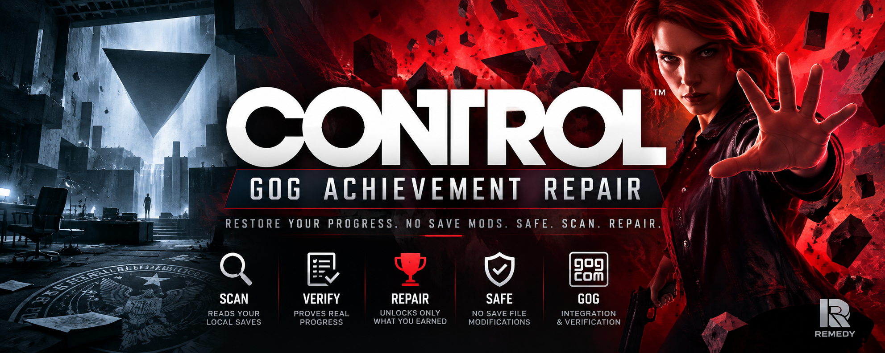

# Control - GOG Achievement Repair

Achievement repair utility for **Control Ultimate Edition (GOG)**.

Current public build: **v0.9.0 - Native First**

## Core principle

Control's **native save data is the primary source of truth**.

GOG Galaxy counters are treated as secondary because testing showed that several counters can be stale or incomplete compared with progress stored by the game itself.

- Native save proof meeting a condition -> `VERIFIED`
- GOG counter below a threshold -> advisory only, never `NOT MET`
- GOG counter at/above a threshold -> accepted only as positive proof
- `date_unlocked` -> authoritative for whether GOG currently reports the achievement unlocked

Example:

```text
Crisis Management
  Native save: 3 completed Bureau Alerts / 5
  GOG counter: 1 / 5 [stale / advisory only]
  Status: INFO
```

When the native save reaches five completed Bureau Alerts, the achievement becomes `VERIFIED` even if Galaxy remains stuck at 1/5.

## Safety

- Reads Control save files only
- Never modifies save files
- Evaluates save slots independently
- Automatic repair is limited to `VERIFIED` achievements
- `INFO` achievements require explicit manual selection and confirmation
- Every GOG achievement write is followed by a fresh server read
- `date_unlocked=null` is never sent
- No user-specific save hash is hard-coded

## Current forensic coverage

The parser currently understands native evidence for campaign state, base-game Control Points, side missions, Foundation mission completion, Foundation/AWE collectible GIDs, hidden-location discovery state, Board Countermeasures, and completed Bureau Alert records.

The remaining combat/event counters are still being reverse-engineered. Low Galaxy counters are intentionally not used as negative evidence.

## Source snapshot

The exact tested V0.9 source is archived losslessly at:

`archive/Control_GOG_Achievement_Repair_V9_NATIVE_FIRST.go.gz.b64`

See `archive/README.md` for reconstruction instructions.

Expected reconstructed source SHA-256:

`dfa768927b98ba68b87c1865dfd1b75d6b9c249f5389e7f9e3087ca8271a1bbc`

## Release packages

The GitHub release provides two clean archives:

- `Control_GOG_Achievement_Repair_v0.9.0_Windows_x64.zip` — `Control_GOG_Achievement_Repair.exe` + `README.md`
- `Control_GOG_Achievement_Repair_v0.9.0_Source.zip` — `Control_GOG_Achievement_Repair.go` + `README.md`

## Build

After reconstructing the Go source:

```bash
GOOS=windows GOARCH=amd64 CGO_ENABLED=0 go build -trimpath -ldflags="-s -w" -o Control_GOG_Achievement_Repair.exe Control_GOG_Achievement_Repair_V9_NATIVE_FIRST.go
```

## Status

v0.9.0 is the current **Native First** public build. The repair path is live-tested against GOG; forensic mapping of the remaining combat/event counters is still ongoing.
